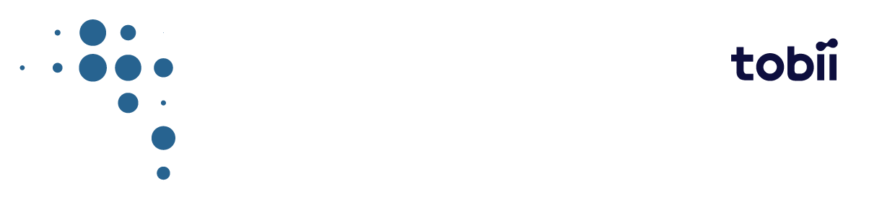
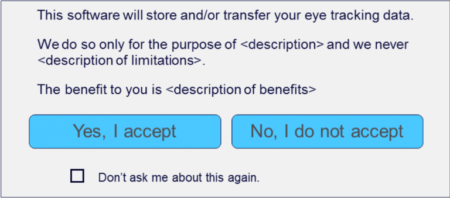

# TOBII SOFTWARE DEVELOPMENT LICENSE AGREEMENT FOR RESEARCH USE

The software and related files that you have downloaded, or otherwise obtained, includes Tobii software which is governed by this license agreement (the **Licensed Software** ). This agreement grants to you limited rights to use the Licensed Software to develop software. Tobii will only provide you with basic support for the Licensed Software that you have downloaded, as described in this document [tobii-pro-support-service-description.pdf](https://www.tobiipro.com/siteassets/tobii-pro/documents/tobii-pro-support-service-description.pdf).

You may only develop software, using the Licensed Software, for **non-commercial research use** under this agreement. If you wish to develop software for, or distribute software to, the public or any other third-party for commercial or medical use, then you must obtain a Commercial and/or Medical Use License from Tobii. Please visit [tobii.com](https://tobii.com) for more information.

Please note that the Licensed Software is only for use with Tobii related hardware and software, and you must not use it to develop or evaluate competing eye tracking or behavioural technologies. If you are interested in additional eye tracking or behavioural capabilities or functionality, the right to develop software for commercial purposes, or if you would like to receive increased support and maintenance from Tobii, please contact Tobii at sales@tobii.com.

Tobii AB (reg. No. 556613-9654), having its registered office at Karlsrovägen 2D, SE-182 53, Danderyd, Sweden (&quot;**Tobii**&quot;), grants you (hereinafter referred to as &quot;**You**&quot;) a license to use the Licensed Software according to the following terms and conditions. This agreement, including any appendices, is hereafter referred to as the &quot;**Agreement**&quot;. Both Tobii and You are a &quot;**Party**&quot; to this Agreement and referred to together as the &quot;**Parties**&quot;. You enter into this Agreement by installing or using the Licensed Software.

WHEREAS, Tobii is a supplier of hardware and software solutions, either standalone or as part of third-party products, for eye tracking and behavioural analysis that contain Intellectual Property Rights owned by Tobii (&quot;**Tobii Eye Tracking**&quot;), and You desire to license from Tobii certain Licensed Software as defined by this Agreement, and any other use of the Licensed Software requires a separate agreement between the Parties.

BEFORE USING THE LICENSED SOFTWARE PLEASE READ THIS AGREEMENT CAREFULLY. BY DOWNLOADING, INSTALLING, USING, ACCESSING OR DISTRIBUTING THE LICENSED SOFTWARE YOU AGREE THAT:

1. YOU HAVE READ AND UNDERSTOOD THE TERMS AND CONDITIONS BELOW;
2. YOU AGREE TO BE BOUND BY THE TERMS OF THIS AGREEMENT; AND
3. UNLESS SPECIFICALLY EXCLUDED BY AN EXISTING AGREEMENT BETWEEN YOU AND TOBII, THIS IS THE COMPLETE AND EXCLUSIVE STATEMENT OF THE RIGHTS AND LIABILITY BETWEEN YOU AND TOBII IN RELATION TO YOUR USE AND DISTRIBUTION OF THE LICENSED SOFTWARE, AND THIS AGREEMENT SUPERSEDES ALL PRIOR COMMUNICATIONS AND AGREEMENTS BETWEEN YOU AND TOBII REGARDING THE LICENSED SOFTWARE.

You may only enter into this Agreement and use the Licensed Software if You are legally permitted to enter into a binding contract with Tobii.

The terms of this Agreement will apply to any updates that Tobii makes available to you. You agree that updates may require you to change or update your application and may affect your ability to use, access or interact with the Licensed Software.

Tobii may amend this Agreement at any time, without notice to You, by posting the revised terms on its website [tobii.com](https://tobii.com).

The terms below are defined as follows under this Agreement:

* **Appendix** means an addendum to this Agreement.
* **Basic Support** means support in accordance with Tobii&#39;s Basic Support contract.
* **Commercial License** means a Software Development License Agreement with Tobii that permits commercialisation of the Licensed Software.
* **Eye Tracking Data** means the following categories data, in raw or processed form, on their own or in combination with other information: (a) Biometric Eye Tracking Data: Data relating to the physical, physiological or behavioral characteristics of a person&#39;s eyes or face; and (b) Psychographic Eye Tracking Data: Any insights derived from biometric eye tracking data relating to a person&#39;s physical, mental, and emotional state, or their interests.
* **High Risk Use** is use in any environment where failure or fault of any kind could lead to death or serious bodily injury of any person, or to severe physical or environmental damage. High Risk Use includes, but is not limited to, aircraft navigation, control of other modes of human mass transportation, military applications and control of nuclear or chemical facilities.
* **Intellectual Property Rights** means patents, rights to apply for patents, trademarks, trade names, service marks, domain names, copyrights, whether registered or unregistered, and all applications and registrations of such worldwide, schematics, industrial models, inventions, know-how, trade secrets, computer software programs and other intangible proprietary information.
* **Licensed Software** means the Tobii Pro SDK and/or Tobii Pro Glasses 2 API and/or Tobii Pro Glasses 3 API downloaded and obtained by You directly or indirectly from Tobii, including all included files, directories, documentation and associated API function calls.
* **Medical Use** is any use in medically classified devices or environments, for instance hospitals, surgeries, or other healthcare environments. Examples of Medical Use include systems for Assistive and Alternative Communication (**AAC**), medical condition assessment solutions, vision or eye condition solutions and solutions or systems intended to be used in hospitals, surgeries and doctor&#39;s consulting rooms.
* **Medical Use License** means a Software Development License Agreement with Tobii that permits commercialisation of the Licensed Software for Medical Use.
* **Research Community** means the community of researchers that work for, and provide research to, academia and not for profit organisations.
* **Store or Transfer** means any method of saving Eye Tracking Data beyond the length of the user session; or any method of sharing Eye Tracking Data so that it can be accessed or observed by others in retrospect, or in real-time on a separate display or device.
* **Your Software** means software developed by You, including all object code, source code, and any related documentation.

1. OVERVIEW
	1. Tobii grants You limited rights to use the Licensed Software subject to the restrictions outlined in this Agreement.
	2. Your use of the Licensed Software is strictly permitted solely to develop Your Software for your own research, use and distribution within the Research Community and non-commercial use outside of the Research Community (&quot;**Your Use**&quot;).

2. LICENSE
	1. Subject to Sections 2.2, 3 and 7, Tobii grants You a limited, non-exclusive, non-transferable, non-sublicensable, revocable, license:
		1. to use the Licensed Software solely to develop Your Software for Your Use, and
		2. to distribute any binary files in the Licensed Software, or the binary form of example source code, in the Licensed Software, only as part of Software developed by You, and
		3. to any Intellectual Property Rights owned by Tobii covering binary files, or example source code, in the Licensed Software, necessary for Your Use.

	2. The license rights in this Section 2 are conditional upon compliance with all terms in this Agreement and, specifically, the following:

		1. You may not commercialise, sell, lease or profit from Your Software. If You wish to commercialise Your Software, or distribute outside of the Research Community, then You must contact Tobii at [sales@tobii.com](mailto:sales@tobii.com) to arrange a Commercial License.
		2. You may not use the Licensed Software on eye tracking platforms other than those produced by Tobii, or platforms that include Tobii hardware.
		3. If Your Software Stores or Transfers Eye Tracking Data, then You must comply with the Eye Tracking Data Transparency Policy in Appendix A of this Agreement.
		4. If Your Software implements an API of its own, which exposes Eye Tracking Data to other third-party software, then You must ensure that:
			1. the other third-party software is for non-commercial use and that it will not be distributed outside of the Research Community, and
			2. that it complies with the Eye Tracking Data Transparency Policy in Appendix A of this Agreement.

3. USE RESTRICTIONS
	1. Except as expressly permitted by this Agreement, You will not, nor permit or authorise anyone to:
		1. distribute, convey, lend, lease, share, sell, transfer, sublicense, rent, or time share the Licensed Software, or any of its components or license files, or permit third parties to download or install the Licensed Software.
		2. copy, decompile, disassemble or reverse engineer or otherwise attempt to extract or derive the source code or any methods, algorithms or procedures from the Licensed Software, or modify, adapt, translate or create derivative works based upon the Licensed Software except as otherwise expressly permitted by applicable law.
		3. take any other steps to derive design information regarding the Licensed Software.
		4. use the Licensed Software if You are a competitor of Tobii.
		5. remove any copyright, trademark or other proprietary notice from the Licensed Software.
		6. alter or circumvent any product, key or license restrictions or limitations on the Licensed Software to defeat any restrictions on access or use.

4. OWNERSHIP OF LICENSED SOFTWARE
Except for the licenses explicitly granted to You, Tobii retains all right, title, and interest in and to the Licensed Software, including all updates and modifications and derivative works created, whether or not specifically recognised, registered, or perfected under the laws of the country in which the Licensed Software is located. You do not own any rights, including the copyright and any other Intellectual Property Rights, in the Licensed Software. Your rights to use the Licensed Software are strictly as specified in this Agreement.

5. USAGE DATA TO ENHANCE USER EXPERIENCE
The Licensed Software may report anonymous usage statistics and/or error and bug reports to Tobii&#39;s servers in order to identify problems that may affect the technical stability and/or overall quality of the application, as well as inform Tobii which of the program components have been in use. For the avoidance of doubt, this data does not include Eye Tracking Data.

6. SUPPORT &amp; MAINTENANCE
Tobii will only provide You with Basic Support for the Licensed Software as described in the following document [tobii-pro-support-service-description.pdf](https://tobiipro.com/siteassets/tobii-pro/documents/tobii-pro-support-service-description.pdf). Tobii will not provide You with maintenance of the Licensed Software and will have no obligation to provide updates to it.

7. MEDICAL OR HIGH-RISK USE
	1. **Medical Use:** You may only develop Your Software for Medical Use that is for non-commercial research purposes, within the Research Community. If you wish to commercialise Your Software for Medical Use, or distribute it outside of the Research Community, then you must contact Tobii at [sales@tobii.com](mailto:sales@tobii.com) to arrange a Medical Use License.
	2. **High-Risk Use:** You have no right to develop Your Software for High-Risk Use under this Agreement. If you wish to use the Licensed Software for High-Risk Use, then you must contact Tobii.

8. LIMITATION OF LIABILITY AND INDEMNIFICATION
	1. In no event will Tobii be liable for the following, whether arising out of the use of or inability to use the Licensed Software or for any other reason, even if it has been advised of the possibility of such damages: (a) indirect, incidental, special or consequential damages; (b) loss or corruption of data or interrupted or loss of business; or (c) loss of revenue, profits, goodwill or anticipated sales or savings. All liability of Tobii, its affiliates, officers, directors, employees, agents and suppliers collectively, to you, whether based in warranty, contract, tort (including negligence), or otherwise, and your exclusive remedy will not exceed USD $100. Some jurisdictions do not allow the limitation or exclusion of liability. Accordingly, some of the above limitations may not apply to You. To the extent that Tobii may not, as a matter of applicable law, disclaim any implied warranty or limit its liabilities, the scope of duration of such warranty and the extent of Tobii&#39;s liability shall be the minimum permitted under such applicable law.
	2. You agree to indemnify, defend and hold harmless Tobii and its licensors, affiliates, contractors, officers, directors, employees or agents from any and all third-party claims, liabilities, damages, costs and expenses, including reasonable attorney fees, arising from your violation of any provision of Sections 2 and 3 of this Agreement.

9. TERM AND TERMINATION
	1. This Agreement remains in force until termination (the &quot;**Term**&quot;).
	2. Tobii may terminate this Agreement at any time for convenience by providing You with thirty (30) days written notice.
	3. If You materially breach this Agreement, or are declared bankrupt, placed into receivership, liquidation or similar mechanism, this Agreement terminates automatically without notice.
	4. Upon termination, all obligations relating to the ownership of the Licensed Software and any indemnification or liability obligations survive.
	5. Upon termination, all rights and licenses granted in this Agreement shall immediately and automatically terminate.

10. Confidentiality
	1. **Confidential Information**. &quot;**Confidential Information**&quot; means any confidential or proprietary information of a Party, whether of a technical, business or other nature (including, but not limited to: trade secrets, know-how and information relating to the technology, customers, business plans, promotional and marketing activities, finances and other business affairs of that Party).
	2. **Confidentiality Obligations.** In the performance of or otherwise in connection with this Agreement, either Party ( **&quot;Disclosing Party&quot;** ) may disclose to the other Party ( **&quot;Receiving Party&quot;** ) certain Confidential Information. The Receiving Party shall treat such Confidential Information as confidential and proprietary to the Disclosing Party and shall use such Confidential Information solely for the purposes for which it is provided by the Disclosing Party. Without limiting the generality of the foregoing, the Receiving Party shall take reasonable precautions to prevent any unauthorized use or disclosure of such Confidential Information and will use at least the same efforts to protect such Confidential Information as the Receiving Party would use to protect its own. The obligations set forth above shall not apply to any:
		1. use or disclosure of any information pursuant to the exercise of the Receiving Party&#39;s rights under this Agreement;
		2. information that is now or later becomes part of the public domain through no fault of the Receiving Party;
		3. information that is obtained by the Receiving Party from a Third Party (other than in connection with this Agreement) who was not under any obligation of secrecy or confidentiality with respect to such information;
		4. information that is independently developed by the Receiving Party (e.g., without reference to any Confidential Information);
		5. disclosure required by applicable law (e.g., pursuant to applicable securities laws or legal process) or stock exchange regulation, provided that the Receiving Party shall use reasonable efforts to give advance notice to and cooperate with the Disclosing Party in connection with any such disclosure; and
		6. disclosure with the consent of the Disclosing Party.

11. GENERAL
  1. **Assignment:** This Agreement, and the rights and obligations herein, are not assignable or transferable by the Licensee under any circumstance, except as may be provided elsewhere in this Agreement.
  2. **NO WARRANTY:** EXCEPT AS SPECIFICALLY PROVIDED HEREIN TOBII MAKES NO WARRANTY, EITHER EXPRESS OR IMPLIED, RELATING TO THE LICENSED SOFTWARE, AND TOBII FURTHER EXPRESSLY DISCLAIMS, TO THE EXTENT PERMITTED BY APPLICABLE LAW, ALL WARRANTIES AND CONDITIONS OF ANY KIND RELATED THERETO, WHETHER EXPRESS OR IMPLIED, INCLUDING, BUT NOT LIMITED TO ANY IMPLIED WARRANTIES AND CONDITIONS OF MERCHANTABILITY, ACCURACY, OR FITNESS FOR A PARTICULAR PURPOSE.
  3. **Governing Law:** This Agreement, including its appendices, will be governed by, and construed according with, the laws of Sweden (without regard to conflict of laws principles), all rights and remedies being governed by said laws. Any dispute or conflict under this agreement shall be finally settled by arbitration administered by the Arbitration Institute of the Stockholm Chamber of Commerce, in accordance with its rules. The seat of the arbitration shall be Stockholm and the tribunal shall comprise of one (1) arbitrator. The language of the arbitration shall be English.
  4. **Disclaimer and Injunctive Relief:** The parties specifically disclaim the application of the UN Convention on Contracts for the International Sale of Goods. Regardless of the above governing law, either party may seek interim injunctive relief respect to any alleged breach of such party&#39;s Intellectual Property Rights or other proprietary rights.

# APPENDIX A

## EYE TRACKING DATA TRANSPARENCY POLICY

If Your Software stores or transfers Eye Tracking Data, then You must comply with this policy and as such, Tobii requires the following to be implemented into Your Software:

- **Active User Acceptance:** Your Software needs to use a consistent format to ask the user, explicitly and clearly, for their permission to store, or transfer, their Eye Tracking Data. This request for permission must happen before the user&#39;s data is stored or transferred. It also needs to state the purpose of storing/transferring Eye Tracking Data and that such data will not be used for any other purpose.
- **Visualisation:** Your Software must show the user when the storing or transferring of Eye Tracking Data is taking place. You must provide a mechanism for visualisation. This is required unless explicitly waived by Tobii.

Tobii recommends that the following is implemented into Your Software:

- The &quot;**What&#39;s in it for me**&quot; policy: Clearly inform users about the value they will receive from Your Software. This is about giving the user clear guidance and motivation about why they should provide their Eye Tracking Data to You.

Please note that the implementation of this policy may vary between different categories of products. For screen-based products, a window, such as the one below, is recommended for the Active User Acceptance and What&#39;s in it for me policy.

## Active User Acceptance - alternative methods of implementation and exemption

Some specific circumstances make a software-based user acceptance impossible or inappropriate. If Your Software is used in either of the situations described in A, B or C below, You may instead implement firm legal requirements on the user of Your Software to conduct an alternative approval process.

**Situation A:** Your Software is used to conduct research, tests or assessments on a test subject which a facilitator operates and oversees, and You prefer that Active User Acceptance from the test subject is provided via a separate process, instead of through Your Software. In this situation, Your Software must, instead, explicitly and in a clear and prominent manner, require that the facilitator takes responsibility to:

1. obtain Active User Acceptance from the test subject via separate means; and
2. inform the test subject about what data was collected, the purpose of the data collection and that the data will not be used for any other purpose; and
3. if the test subject does not give such consent, permanently delete the data from that test subject.

Only upon confirmation of this by the facilitator will Your Software be allowed continued use. This process must be followed at least every time Your Software is started.

**Situation B:** Your Software is used to collect Eye Tracking Data from an individual that is not of legal age, or a user who is not physically or mentally able or fit to provide Active User Acceptance. In such situation, Your Software may instead implement a process where Active User Acceptance is collected from a legal guardian of the user. This may be done either via Your Software, or via a different method (such as a paper-based form), prior to collecting the data. In either case, such Active User Acceptance form must be very explicit and in a clear way provide information about which data will be collected, and it must state the purpose of the Eye Tracking Data collection and that the Eye Tracking Data will not be used for any other purpose.

**Situation C:** Your Software is used to collect Eye Tracking Data from a user who is under a medical emergency where there is an imminent risk to the user&#39;s life or health. When the application is used in such situation, Active User Acceptance is not required.

## Terminology

&quot;Eye Tracking Data&quot; means the following categories data, in raw or processed form, on their own or in combination with other information:

- **Biometric Eye Tracking Data** : ​Data relating to the physical, physiological or behavioral characteristics of a person&#39;s eyes or face; and
- **Psychographic Eye Tracking Data** : ​Any insights derived from biometric eye tracking data relating to a person&#39;s physical, mental, and emotional state, or their interests.

&quot;Store or transfer&quot; means any method of saving Eye Tracking Data beyond the length of the user session; or any method of sharing Eye Tracking Data so that it can be accessed or observed by others in retrospect, or in real-time on a separate display or device.

**Learn More**

You can learn more about the policy at [transparency.tobii.com](https://transparency.tobii.com).

# APPENDIX B

## TOBII TRADEMARKS

Your Software shall clearly present in an &quot;About box&quot; or other corresponding notice visible to the End User:

1. the Tobii logotype in reasonable size; and
2. the text &quot;_Eye Tracking by Tobii_&quot; in standard font size.

# APPENDIX C

## MEDICAL USE TERMS &amp; CONDITIONS

1. Licensee acknowledges that the Licensed Technology is not fault tolerant and, accordingly, is not designed, intended or allowed for use in any situation where failure, or fault of any kind, could lead to death, or serious bodily injury, of any person.
2. Licensee is prohibited from developing software which is designed, intended or allowed for use in any situation where failure or fault of any kind could lead to death, or serious bodily injury, of any person, including any medical, surgical, or other use intended to support or sustain life.
3. Any Medical Use whatsoever, is solely and completely at Licensee&#39;s own risk, cost and liability.
4. Licensee is solely responsible for any work and/or certifications required to enable Your Software for such Medical Use.
5. Tobii shall in no case have any liability whatsoever (whether to Licensee or to any third party) for the Licensee&#39;s use of the Licensed Technology, or Your Software, in any such manner.

© Tobii AB. Version dated 10 May 2022.

